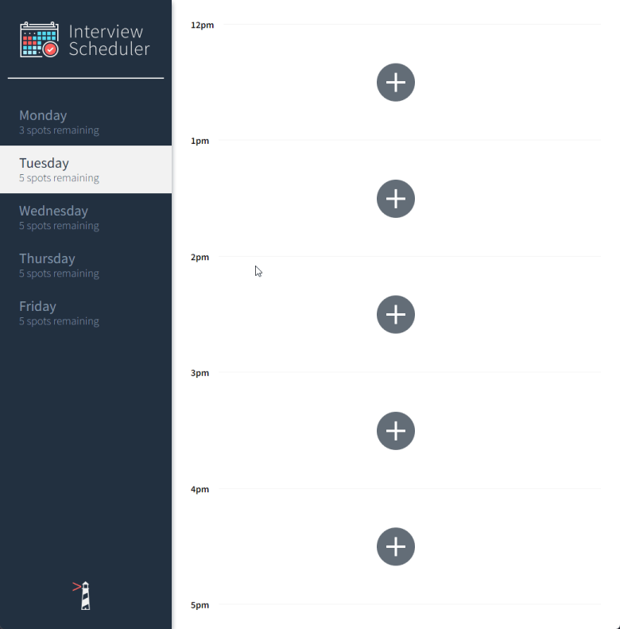

Interview Scheduler
=========

Interview Scheduler is a simple scheduling web application built with Node, React, and Postgres. Bundled with Cypress and Jest testing frameworks.\
https://ct-scheduler-lhl.netlify.app/

[](https://app.netlify.com/sites/ct-scheduler-lhl/deploys)

## Final Product


## Setup

Install dependencies with `npm install`.

## Running Webpack Development Server

```sh
npm start
```

## Running Jest Test Framework

```sh
npm test
```

## Running Storybook Visual Testbed

```sh
npm run storybook
```

## Dependencies

- Node 12.x or above
- NPM 5.x or above
- PG 6.x
